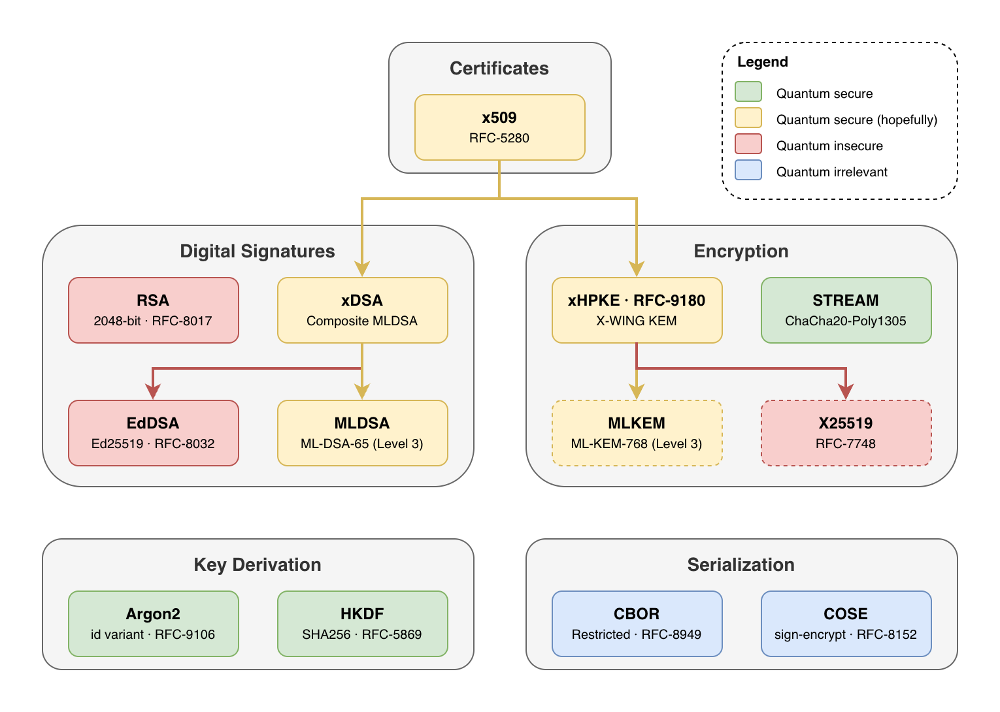

# Post-Quantum Cryptography in Rust

This repository is parameter selection and lightweight wrapper around a number of Rust cryptographic libraries. Its purpose isn't to implement primitives, rather to unify the API surface of existing libraries; limited to the tiny subset needed by the Dark Bio project.

The library is opinionated. Parameters and primitives were selected to provide matching levels of security in a post-quantum world. APIs were designed to make the library easy to use and hard to misuse. Flexibility will always be rejected in favor of safety.

- Digital signatures
  - **xDSA ([RFC-DRAFT](https://datatracker.ietf.org/doc/html/draft-ietf-lamps-pq-composite-sigs))**: `MLDSA`, `EdDSA`, `SHA512`
    - **EdDSA ([RFC-8032](https://datatracker.ietf.org/doc/html/rfc8032))**: `Ed25519`
    - **MLDSA ([RFC-9881](https://datatracker.ietf.org/doc/html/rfc9881))**: Security level 3 (`ML-DSA-65`)
  - **RSA ([RFC-8017](https://datatracker.ietf.org/doc/html/rfc8017))**: 2048-bit, `SHA256`
- Encryption
  - **xHPKE ([RFC-9180](https://datatracker.ietf.org/doc/html/rfc9180))**: `X-WING`, `HKDF`, `SHA256`, `ChaCha20`, `Poly1305`
    - **X-WING ([RFC-DRAFT](https://datatracker.ietf.org/doc/html/draft-connolly-cfrg-xwing-kem))**: `MLKEM`, `ECC`
      - **ECC ([RFC-7748](https://datatracker.ietf.org/doc/html/rfc7748))**: `X25519`
      - **MLKEM([RFC-DRAFT](https://datatracker.ietf.org/doc/html/draft-ietf-ipsecme-ikev2-mlkem))**: Security level 3 (`ML-KEM-768`)
  - **STREAM (*RFC N/A*, [Rage](https://github.com/str4d/rage))**: `ChaCha20`, `Poly1305`, `16B` tag, `64KB` chunk
- Key derivation
  - **Argon2 ([RFC-9106](https://datatracker.ietf.org/doc/html/rfc9106))**: `id` variant
  - **HKDF ([RFC-5869](https://datatracker.ietf.org/doc/html/rfc5869))**: `SHA256`
- Serialization
  - **CBOR ([RFC-8949](https://datatracker.ietf.org/doc/html/rfc8949))**: restricted to `bool`,`null`, `integer`, `text`, `bytes`, `array`, `map[int]`, `option`
  - **COSE ([RFC-8152](https://datatracker.ietf.org/doc/html/rfc8152))**: `COSE_Sign1`, `COSE_Encrypt0`, `dark-bio-v1:` domain prefix
- Credential / Attestation
  - **CWT ([RFC-8392](https://datatracker.ietf.org/doc/html/rfc8392))**: `xDSA`, `xHPKE`
    - **EAT ([RFC-9711](https://datatracker.ietf.org/doc/html/rfc9711))**

All functionality is WASM ready.

*The entire library is hidden behind feature flags to allow selectively depending on it from the firmware, cloud and mobile app, each cherry-picking only what's needed.*

## Feature gates

As a starting point, you will most probably want `xdsa` for digital signatures, `xhpke` for asymmetric encryption and `cose` for proper enveloping. For the remainder for the features, please consult the list below:

| Feature  | Description                                                                                                                                                                 | Dependencies             |
|----------|-----------------------------------------------------------------------------------------------------------------------------------------------------------------------------|--------------------------|
| `argon2` | Argon2id password hashing ([RFC-9106](https://datatracker.ietf.org/doc/html/rfc9106))                                                                                       |                          |
| `cbor`   | CBOR serialization with derive macros ([RFC-8949](https://datatracker.ietf.org/doc/html/rfc8949))                                                                           |                          |
| `cose`   | COSE signed/encrypted envelopes ([RFC-8152](https://datatracker.ietf.org/doc/html/rfc8152))                                                                                 | `cbor`, `xhpke`          |
| `eddsa`  | Ed25519 signatures ([RFC-8032](https://datatracker.ietf.org/doc/html/rfc8032))                                                                                              | `pem`                    |
| `hkdf`   | HKDF key derivation with SHA-256 ([RFC-5869](https://datatracker.ietf.org/doc/html/rfc5869))                                                                                |                          |
| `mldsa`  | ML-DSA-65 post-quantum signatures ([FIPS-204](https://csrc.nist.gov/pubs/fips/204/final))                                                                                   | `pem`                    |
| `pem`    | PEM encoding for keys and certificates ([RFC-7468](https://datatracker.ietf.org/doc/html/rfc7468))                                                                          |                          |
| `rand`   | Random number generation utilities                                                                                                                                          |                          |
| `rsa`    | RSA-2048 signatures with SHA-256 ([RFC-8017](https://datatracker.ietf.org/doc/html/rfc8017))                                                                                | `pem`                    |
| `stream` | STREAM chunked encryption (Age-compatible)                                                                                                                                  |                          |
| `x509`   | X.509 certificate creation and parsing ([RFC-5280](https://datatracker.ietf.org/doc/html/rfc5280))                                                                          | `xdsa`                   |
| `xdsa`   | Composite signatures (EdDSA + ML-DSA) ([DRAFT](https://datatracker.ietf.org/doc/html/draft-ietf-lamps-pq-composite-sigs))                                                   | `eddsa`, `mldsa`, `x509` |
| `xhpke`  | Hybrid encryption with X-Wing KEM ([RFC-9180](https://datatracker.ietf.org/doc/html/rfc9180), [DRAFT](https://datatracker.ietf.org/doc/html/draft-connolly-cfrg-xwing-kem)) | `xdsa`                   |

## Derive Cbor

The `cbor` feature provides a `#[derive(Cbor)]` macro that generates encoders and decoders for structs. By default, structs are represented as maps, with the possibility of requesting array encoding.

In map encoding mode, all keys are integers. This is a deliberate restriction to support maps but still force non-wasteful encoding. Each field requires `#[cbor(key = N)]`. To encode a struct as an array, use `#[cbor(array)]`.

## Siblings

This is a sibling package with the Go [`github.com/dark-bio/crypto-go`](https://github.com/dark-bio/crypto-go); as in, both repositories implement the same feature sets and API surfaces at the same version points. This naturally means PRs merged into one project necessarily have to have a counter-PR in the other project.

## Bindings

This package currently has a Flutter binding [`github.com/dark-bio/crypto-fl`](https://github.com/dark-bio/crypto-fl) that exposes the same API surface and versioning; implemented by wrapping the Rust code via FFI rather than reimplementing it.

This package also has a TypeScript binding [`github.com/dark-bio/crypto-ts`](https://github.com/dark-bio/crypto-ts) that also exposes the same API surface and versioning; implemented by wrapping the Rust code via WASM rather than reimplementing it.

## Acknowledgements

Shoutout to Filippo Valsorda ([@filosottile](https://github.com/filosottile)) for lots of tips and nudges on what kind of cryptographic primitives to use and how to combine them properly; and also for his work in general on cryptography standards.

Naturally, many thanks to the authors of all the libraries this project depends on.
